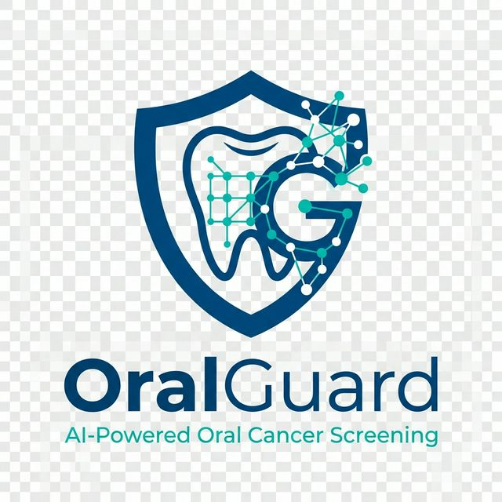

# OralGuard (OC-Detect) 🦷🛡️

[](https://github.com/SrivarsanK/OC-Detect)

**OralGuard** is an advanced AI-powered clinical triage system designed for the early detection and risk stratification of oral cancer in the Indian sub-continent. It bridges the gap between high-performance deep learning and clinical safety through uncertainty quantification and explainable AI (XAI).

## 🚀 Key Features

### 1. Advanced AI Inference Engine
- **EfficientNet-B4 Architecture**: Optimized for high-resolution morphological feature extraction.
- **Monte Carlo (MC) Dropout**: Quantifies predictive uncertainty ($T=30$ forward passes) to flag ambiguous cases.
- **Test-Time Augmentation (TTA)**: Stabilizes predictions across 5 geometric transforms.

### 2. Clinical Reconciliation Layer
- **Handcrafted Features**: Extracts 29 domain-specific scalar features including:
  - **Color**: Red/White patch ratios (Erythroplakia/Leukoplakia indicators).
  - **Texture**: GLCM (Contrast, Energy) and LBP entropy for surface irregularity.
  - **Shape**: Edge density and border circularity for lesion boundary analysis.
- **Clinical Gating**: AI predictions are cross-referenced with quantitative clinical markers to reduce False Positives.

### 3. Explainability & Trust
- **Grad-CAM**: Generates 40% alpha-blended activation heatmaps to visualize the regions of focus within the oral cavity.
- **Automated Pathologic Reporting**: Generates professional-grade **PDF and JSON reports** following institutional pathology formats (Gross/Microscopic Description, CPT Codes).

### 4. Enterprise Ready
- **Interoperability**: Structured data exports compatible with healthcare standards.
- **Security**: Local image persistence and database encryption.
- **Scalability**: Asynchronous cloud synchronization with post-processing capabilities.

## 🛠️ Tech Stack

- **Backend**: FastAPI (Python 3.12), PyTorch 2.5, OpenCV, SQLAlchemy, FPDF2.
- **Frontend**: Next.js 15+, React 19, Tailwind CSS, Framer Motion.
- **Database**: Encrypted SQLite.
- **Infrastructure**: Docker, Docker Compose.

## 📂 Project Structure

```text
OC-Detect/
├── dashboard/          # Next.js Frontend (Clinical Dashboard)
├── src/                # FastAPI Backend
│   ├── api/            # REST Endpoints (Cases, Ingestion, Features)
│   ├── services/       # Core Logic (Inference, Processor, Reporting)
│   ├── models/         # Database & ML Architectures
│   ├── db/             # Persistence Layer
│   └── core/           # Configs and Security
├── notebooks/          # SOTA Training Pipeline (EfficientNet + SWA)
├── artifacts/          # Generated Reports and Checkpoints
└── Dockerfile          # Containerization
```

## ⚡ Quick Start

### Prerequisites
- Python 3.10+
- Node.js 20+
- Docker (Optional)

### Using Docker (Recommended)
```bash
docker-compose up --build
```
- **API Docs**: `http://localhost:8000/docs`
- **Dashboard**: `http://localhost:8000/view`

### Manual Setup

1. **Environment Setup**
   ```bash
   cp .env.template .env
   # Update settings in .env
   ```

2. **Backend Installation**
   ```bash
   pip install -r requirements.txt
   python -m src.main
   ```

3. **Frontend Installation**
   ```bash
   cd dashboard
   npm install
   npm run dev
   ```

## 📡 API Reference

### Case Management
| Method | Endpoint | Description |
|--------|----------|-------------|
| `POST` | `/api/v1/ingest/upload` | Upload image for full AI triage and report generation. |
| `PATCH` | `/api/v1/cases/{case_id}` | Update clinical metadata and regenerate reports. |
| `GET` | `/api/v1/cases/` | List all processed triage cases. |
| `GET` | `/api/v1/cases/{id}/report/pdf` | Download the clinical pathology report (PDF). |

### Feature Extraction
| Method | Endpoint | Description |
|--------|----------|-------------|
| `POST` | `/api/v1/features/extract` | Standalone handcrafted feature extraction (Color/Texture). |

## 🛡️ Clinical Validation & Safety

OralGuard implements a **multi-tier safety protocol**:
1. **Quality Check**: Rejects blurry or poorly lit images using Laplacian variance scoring.
2. **Uncertainty Gating**: Results with high predictive entropy ($H > 0.35$) are flagged as "High Uncertainty" for mandatory specialist review.
3. **Local Audit Trail**: Maintains raw images vs. enhanced ROI for verification.

---
*Created for the Advancement of Oral Healthcare Informatics.*
